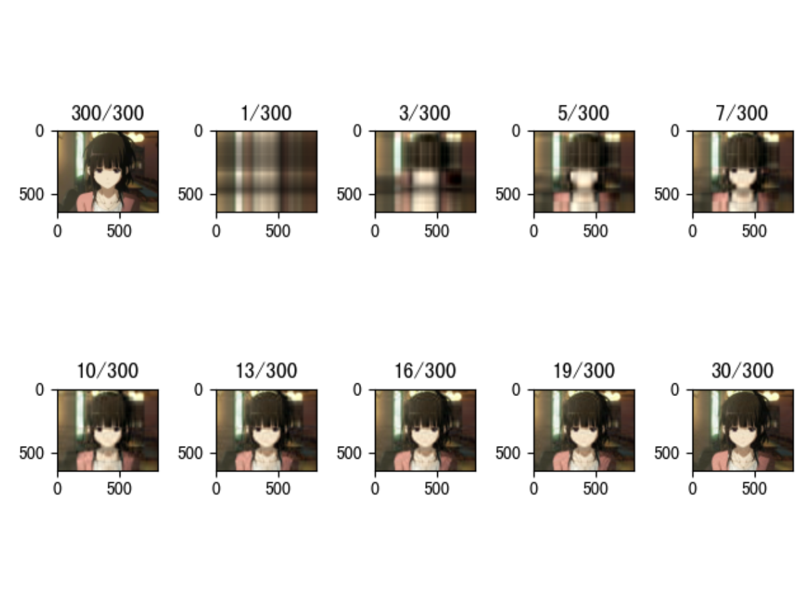

# svd奇异值分解及其运用
    之前同学都已经介绍了原理，本着做一遍才算理解的学习思路，用原生的np.linalg.eig实现了一个简单的svd函数。
做的过程中也碰到了一些问题，如下做法是错的
```code
sigma,V=np.linalg.eig(A.T @ A)  
sigma,U=np.linalg.eig(A @ A.T)
// 错误
```

因为特征值正负号是随机的，所以U和V的特征向量正负号是有某种关联的，所以正确的做法是通过U推导VT或者通过VT推导U: A=U@sigma@VT

还有另一种源码的思路：源码实现中有一个svd_flip（U,V）函数，SVD奇异值分解的结果是唯一的，但是分解出来的U矩阵和V矩阵的正负可以不是唯一，只要保证它们乘起来是一致的就行。因此，sklearn为了保证svd分解结果的一致性，它们的方案是：保证U矩阵的每一行(u_i)中，绝对值最大的元素一定是正数，否则将u_i转成-u_i,并将相应的v_i转成-v_i已保证结果的一致。


#### 这里附上svd实现的代码
```
import numpy as np

def svd(A):
    m, n = A.shape
    if m > n:
        sigma, V = np.linalg.eig(A.T @ A)
        # 将sigma 和V 按照特征值从大到小排列
        arg_sort = np.argsort(sigma)[::-1]
        sigma = np.sort(sigma)[::-1]
        V = V[:, arg_sort]

        # 对sigma进行平方根处理
        sigma_matrix = np.diag(np.sqrt(sigma))

        sigma_inv = np.linalg.inv(sigma_matrix)

        U = A @ V.T @ sigma_inv
        U = np.pad(U, pad_width=((0, 0), (0, m - n)))
        sigma_matrix = np.pad(sigma_matrix, pad_width=((0, m - n), (0, 0)))
        return (U, sigma_matrix, V)
    else:
        # 同m>n 只不过换成从U开始计算
        sigma, U = np.linalg.eig(A @ A.T)
        arg_sort = np.argsort(sigma)[::-1]
        sigma = np.sort(sigma)[::-1]
        U = U[:, arg_sort]

        sigma_matrix = np.diag(np.sqrt(sigma))
        sigma_inv = np.linalg.inv(sigma_matrix)
        V = sigma_inv @ U.T @ A
        V = np.pad(V, pad_width=((0, n - m), (0, 0)))

        sigma_matrix = np.pad(sigma_matrix, pad_width=((0, 0), (0, n - m)))
        return (U, sigma_matrix, V)


if __name__ == "__main__":
    a = np.array([[12, -5, 7, 62333, 255], [-2, 1, -10, 4, 4], [3, 6, 7, 5, -2]])
    U, sigma, V = svd(a)
    print(U @ sigma @ V)

```

#### 这里用svd做了一个图片压缩工具
```
from svd import svd
import numpy as np
from PIL import Image
import matplotlib.pyplot as plt


# np.set_printoptions(threshold=np.inf)

class ImgCompresser():
    def __init__(self, image):
        image = image / 255
        self.imag_shape = image.shape
        self.image = image.reshape((self.imag_shape[0], -1))
        self.U, self.sigma, self.VT = svd(self.image)

    def compress(self, sval_nums):
        compressed = self.U[:, 0:sval_nums] @ self.sigma[0:sval_nums, 0:sval_nums] @ self.VT[0:sval_nums, :]
        return compressed.reshape(self.imag_shape)


arr = np.array([[1, 2, 3], [4, 5, 6]])
# print(pca(arr))

image = Image.open('bingguo.jpg')
image = np.array(image)
compresser = ImgCompresser(image)

image = image.reshape((image.shape[0], -1, 3))
fix, ax = plt.subplots(2, 5)
# fix, ax = plt.subplots(2, 5, figsize=(20, 20))
ax[0, 0].set(title='300/300')
ax[0, 0].imshow(image)
ax[0, 1].set(title='1/300')
ax[0, 1].imshow(compresser.compress(sval_nums=1))
ax[0, 2].set(title='3/300')
ax[0, 2].imshow(compresser.compress(sval_nums=3))
ax[0, 3].set(title='5/300')
ax[0, 3].imshow(compresser.compress(sval_nums=5))
ax[0, 4].set(title='7/300')
ax[0, 4].imshow(compresser.compress(sval_nums=7))
ax[1, 0].set(title='10/300')
ax[1, 0].imshow(compresser.compress(sval_nums=10))
ax[1, 1].set(title='13/300')
ax[1, 1].imshow(compresser.compress(sval_nums=13))
ax[1, 2].set(title='16/300')
ax[1, 2].imshow(compresser.compress(sval_nums=16))
ax[1, 3].set(title='19/300')
ax[1, 3].imshow(compresser.compress(sval_nums=19))
ax[1, 4].set(title='30/300')
ax[1, 4].imshow(compresser.compress(sval_nums=30))
plt.show()
```



#### svd个人理解
svd主要能够提取出一些相互正交的信息，然后有些维度的信息量比较小，可以通过去除这些维度减少数据量而且较高程度保留原始信息，
特征值越大，对应的信息越多，机器学习中常用svd做主成分分析pca,比如房价预测中,对于长，宽，面积，就可以去除面积这个属性，减少参数量，加快训练速度，
提取出最重要的一些参数。